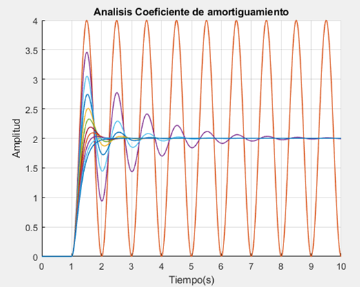

## Análisis del factor de amortiguamiento de un sistema.

• Se observa el comportamiento del factor de amortiguamiento, con intervalos desde 0 hasta 1, numero de pasos de 0.1. A medida que el valor del factor de amortiguamiento cambia la respuesta al sistema se ve afectada, mientras menor sea el valor del factor de amortiguamiento, más oscilatoria es la respuesta.

•	En la siguiente grafica vemos el comportamiento del coeficiente de amortiguamiento, Se especifico un rango deseado del factor de amortiguamiento en las cuales se desea obtener la respuesta a un sistema de lazo abierto, se le asignan valores del coeficiente de amortigumiento en el que se especifica el factor de amortiguamiento inicial (0) , el incremento (0.1) y el factor de amortiguamiento final (1). Se toma como referencia de periodo el tiempo del escalon, que se usa para encontrar la frecuencia natural angular del sistema (2*pi/Tu). Se tienen varias raices que van generando una grafica dependiendo de su valor. 0 < sita < 1 Sistema subamortiguado, sita = 1 Sistema criticamente amortiguado, sita >1 Sistema sobrebamortiguado y sita =0 Sistema oscilatorio.

  

•	Los valores pequeños de sita producen valores de disparos altos en la respuesta transitoria, analogamente sucede con valores grandes.

